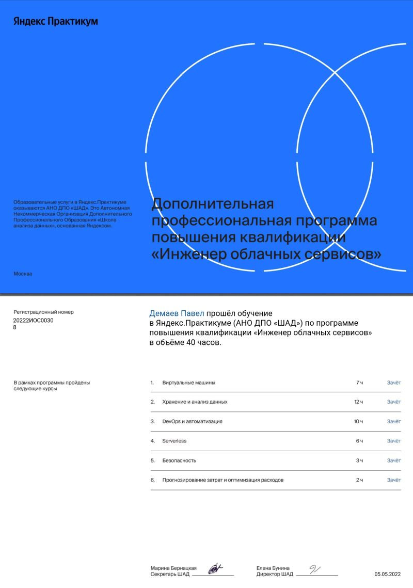
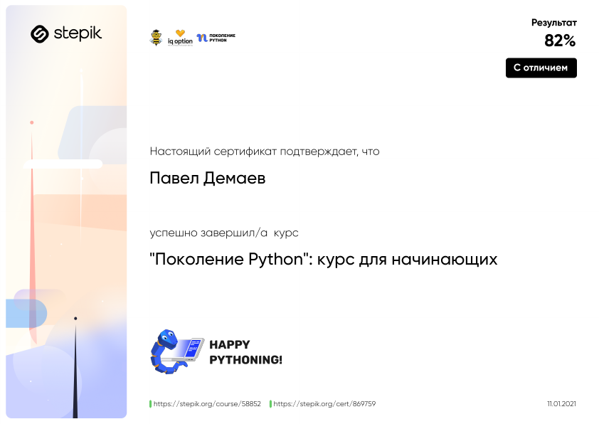

# Pavel Demaev
### System Administrator Linux

---

#### Contact information:

Phone: +7 926 7073614<br>
E-mail: ctpater@gmail.com<br>
GitHub: CTpaTer<br>
Discord: Pavel Demaev (@CTpaTer)<br>
[LinkedIn](https://www.linkedin.com/in/pavel-viktorovich-ab8a5b218/)

---

#### About Myself:
I work as a system administrator for over 20 years. I started with administering Windows systems, as my experience grew, I became more interested in Linux and networking equipment. 
Three years ago I moved to another city and found a place, where I could combine my hobbies with my work. The large amount of equipment allowed me to increase my skills in working with routers and switches Cisco, Avaya, Ciena. My proposal to upgrade the infrastructure was accepted by the management. I deployed a network of hypervisors on Hyper-V, ESXi, Proxmox. Installed Zabbix monitoring system, ELK stack.
I plan to develop further in the direction of DevOps (an acronym for development and operations), which performs the interaction of developers with information technology service specialists and the mutual integration of their work processes into each other to ensure product quality, so knowledge of Web Development will be very useful to me.

---

#### Code example:
```
function addBanTracks(){
    let BanTracks = Source.getPlaylistTracks('banArtists', '2XIwTqz4adSo0E2zABTRXK'); 
    if (BanTracks.length < 1) {
      console.log('The playlist is empty. The performance is interrupted.');
      return;
    } 
    Cache.append('BannedTracks.json', BanTracks);
    let BanTracksFile = Cache.read('BannedTracks.json');
    Filter.dedupTracks(BanTracksFile);
    Cache.compressTracks(BanTracksFile);
    Cache.write('BannedTracks.json', BanTracksFile);
    console.log('Tracks for ban:', BanTracksFile.length);
    Playlist.removeTracks('2XIwTqz4adSo0E2zABTRXK', BanTracks);
}
```

---

#### Skills and Proficiency:
- HTML, CSS
- Python
- JavaScript Basics
- Git, GitHub

---

#### Courses:
- cloud engineer from [Yandex Practicum](https://practicum.yandex.ru/ycloud/)



- "Python Generation": A Course for Beginners from [stepik.org](https://stepik.org/cert/869759)



---

#### Language:
- **Russian** - *Native*
- **English** - *B1/Intermediate*
(based on the online test results at  [www.efset.org](https://www.efset.org/quick-check))

